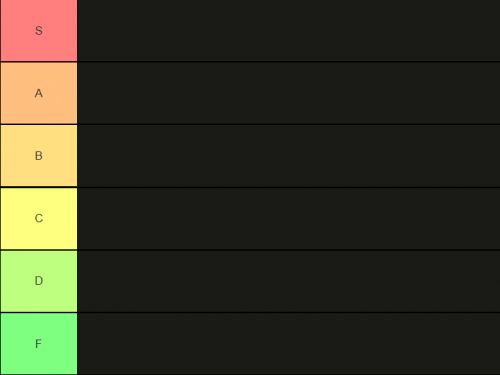

# Aufgabe

In dieser Aufgabe wird die Logik einer Tierliste implementiert.




Die Aufgabe besteht darin das aktuelle HTML Template zu einer funktionierenden Applikation zu konvertieren.
Die Applikation ist aktuell nur in einzelnen HTML Elementen aufgebaut. Versuche logische Komponenten zu erstellen und
dabei möglichst das gleiche Ergebnis dabei zu behalten.

Informiere dich in [forms.md](../../02-additional/forms.md) wie man mit Forms umgehen kann.
Implementieren das Form so, dass die Elemente im korrekten Tier landet.

Informiere dich im Internet oder schau in die [Aufgaben Hilfe](#aufgaben-hilfe)
## Aufgaben Hilfe

<details>
  <summary>Wie zeige ich Variablen an?</summary>

```tsx
```
</details>

## Musterlösung

<details>
  <summary>Möchtest du bereits die Lösung anschauen?</summary>

[Cat.tsx](src/Cat.tsx)

```tsx

```

[index.tsx](src/index.tsx)

```tsx

```

</details>

[//]: # (## Challenge)

[//]: # ()
[//]: # (Erstell ein Interface mit den wichtigsten Informationen des Katzen. Erstelle eine Liste mit diesen Katzen Elementen.)

[//]: # (Lass die Katzen dynamisch rendern.)

[//]: # (Erfülle dabei folgendes: )

[//]: # (* Die Reihenfolge ist zufällig.)

[//]: # (* Es werden keine Elemente doppelt angezeigt.)

[//]: # (* Es werden noch weitere Katzen hinzugefügt nebst den initialen Katzen, hierzu kannst du diesen Service verwenden: https://cataas.com/cat)

[//]: # ()
[//]: # (## Challenge Musterlösung)

[//]: # ()
[//]: # (<details>)

[//]: # (  <summary>Möchtest du bereits die Lösung anschauen?</summary>)

[//]: # ()
[//]: # ()
[//]: # (  ```tsx)

[//]: # (  ```)

[//]: # ()
[//]: # (</details>)
