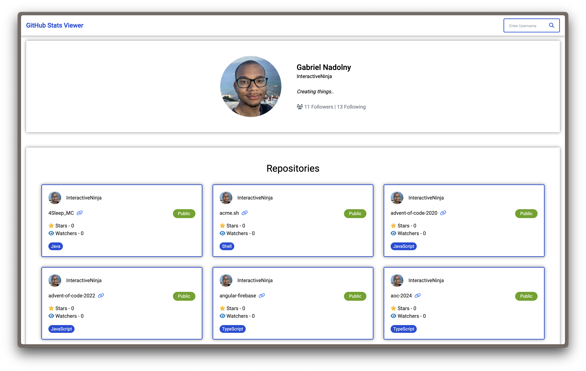

# Aufgabe

In dieser Aufgabe erstellt du einen Github Account Viewer.


Beispiel hier von [GokulAbisheak](https://github.com/GokulAbisheak/github-stats-viewer?tab=readme-ov-file)

Der Ablauf der Applikation sollte wie folgt ablaufen.

1. User gibt in ein Textfeld sein Github Benutzername ein. Bsp: InteractiveNinja
2. Es werden mehrere REST Requests an Github geschickt. Die zurück kommenden Informationen werden in der Applikation dargestellt. 
   - Dargestellte User Informationen
     - Username
     - Realname (wenn vorhanden)
     - Profilbild
     - Beschreibung
     - Followers und Following
     - Company
     - Blog
     - Link zum Repository
   - Dargestellte Repository Informationen
     - Name
     - Owner Name
     - Owner Profilbild
     - Sprache
     - Forks
     - Stars
     - Watchers

Ziel ist es ein vergleichbares Ergebnisse zu erreichen.

Informiere dich in [axios.md](../../02-additional/axios.md) wie man mit axios umgehen kann.
Informiere dich im Internet oder schau in die [Aufgaben Hilfe](#aufgaben-hilfe)

### Endpunkte Informationen
Informationen zu den REST Endpunkt für User Informationen [können hier gefunden werden.](https://docs.github.com/en/rest/users/users?apiVersion=2022-11-28#get-a-user)
Endpunkt: `https://api.github.com/users/USERNAME`

Informationen zu den REST Endpunkt für Repository Informationen [können hier gefunden werden.](https://docs.github.com/en/rest/repos/repos?apiVersion=2022-11-28#list-repositories-for-a-user)
Endpunkt: `https://api.github.com/users/USERNAME/repos
`

### Styling Informationen
Bootstrap 5.3.3 ist installiert und kann verwendet werden. [Dokumentation findet ihr hier](https://getbootstrap.com/docs/5.3/getting-started/introduction/)

Ausserdem ist Bootstrap-icons 1.11.3 installiert. [Dokumentation findet ihr hier](https://icons.getbootstrap.com/)

## Aufgaben Hilfe

<details>
  <summary>Wie verwende ich Icons?</summary>

Icons können wie diese cone [hier beschrieben folgende verwendet werden](https://icons.getbootstrap.com/icons/cone-striped/)
```tsx
<i class="bi bi-cone-striped"></i>
```
</details>

## Musterlösung

<details>
  <summary>Möchtest du bereits die Lösung anschauen?</summary>

Noch WIP ;)

</details>
